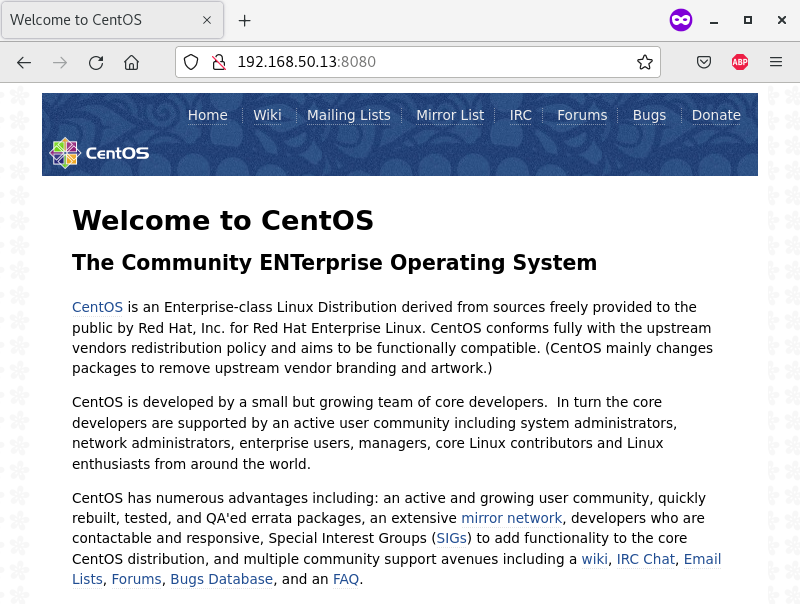

<h3>### IPTABLES ###</h3>

<h4>Описание домашнего задания</h4>

Сценарии iptables

<ol>
<li>реализовать knocking port 
● centralRouter может попасть на ssh inetrRouter через knock скрипт 
пример в материалах.</li>
<li>добавить inetRouter2, который виден(маршрутизируется (host-only тип сети для виртуалки)) с хоста или форвардится порт через локалхост.</li>
<li>запустить nginx на centralServer.</li>
<li>пробросить 80й порт на inetRouter2 8080.</li>
<li>дефолт в инет оставить через inetRouter. 
Формат сдачи ДЗ - vagrant + ansible 
● реализовать проход на 80й порт без маскарадинга</li>
</ol>

Для выполнения данного ДЗ воспользуемся стендом из ДЗ "Архитектура сетей" и добавим к этому стенду сервер inetRouter2:

<table>
<tr>
    <th>Server</th>
    <th>IP and Bitmask</th>
    <th>OS</th>
</tr>
<tr>
    <td rowspan="3">inetRouter</td>
    <td>Default-NAT address VirtualBox</td>
    <td rowspan="3">CentOS 7</td>
</tr>
<tr>
    <td>192.168.255.1/30</td>
</tr>
<tr>
    <td>192.168.50.10/24</td>
</tr>
<tr>
    <td rowspan="7">centralRouter</td>
    <td>192.168.255.2/30</td>
    <td rowspan="7">CentOS 7</td>
</tr>
<tr>
    <td>192.168.0.1/28</td>
</tr>
<tr>
    <td>192.168.0.33/28</td>
</tr>
<tr>
    <td>192.168.0.65/26</td>
</tr>
<tr>
    <td>192.168.255.9/30</td>
</tr>
<tr>
    <td>192.168.255.5/30</td>
</tr>
<tr>
    <td>192.168.50.11/24</td>
</tr>
<tr>
    <td rowspan="2">centralServer</td>
    <td>192.168.0.2/28</td>
    <td rowspan="2">CentOS 7</td>
</tr>
<tr>
    <td>192.168.50.12/24</td>
</tr>
<tr>
    <td rowspan="2">inetRouter2</td>
	<td>192.168.255.3/30</td>
    <td rowspan="2">CentOS 7</td>
</tr>
<tr>
    <td>192.168.50.13/24</td>
</tr>
<tr>
    <td rowspan="6">office1Router</td>
    <td>192.168.255.10/30</td>
    <td rowspan="6">Ubuntu 20</td>
</tr>
<tr>
    <td>192.168.2.1/26</td>
</tr>
<tr>
    <td>192.168.2.65/26</td>
</tr>
<tr>
    <td>192.168.2.129/26</td>
</tr>
<tr>
    <td>192.168.2.193/26</td>
</tr>
<tr>
    <td>192.168.50.20/26</td>
</tr>
<tr>
    <td rowspan="2">office1Server</td>
    <td>192.168.2.130/26</td>
    <td rowspan="2">Ubuntu 20</td>
</tr>
<tr>
    <td>192.168.50.21/26</td>
</tr>
<tr>
    <td rowspan="5">office2Router</td>
    <td>192.168.255.6/30</td>
    <td rowspan="5">Debian 11</td>
</tr>
<tr>
    <td>192.168.1.1/26</td>
</tr>
<tr>
    <td>192.168.1.129/26</td>
</tr>
<tr>
    <td>192.168.1.193/26</td>
</tr>
<tr>
    <td>192.168.50.30/26</td>
</tr>
<tr>
    <td rowspan="2">office2Server</td>
    <td>192.168.1.2/26</td>
    <td rowspan="2">Debian 11</td>
</tr>
<tr>
    <td>192.168.50.31/26</td>
</tr>
</table>

Запустим эти виртуальные машины:

<pre>[user@localhost iptables]$ vagrant up</pre>

<pre>[user@localhost iptables]$ vagrant status
Current machine states:

inetRouter                running (virtualbox)
centralRouter             running (virtualbox)
centralServer             running (virtualbox)
inetRouter2               running (virtualbox)

This environment represents multiple VMs. The VMs are all listed
above with their current state. For more information about a specific
VM, run `vagrant status NAME`.
[user@localhost iptables]$</pre>

<h4>Реализация knocking port</h4>

У нас есть сервер inetRouter с IP-адресом 192.168.255.1. Нам необходимо запретить до него доступ всем, кроме тех, кто знает «как правильно постучаться». Последовательность портов будет такая: 8881 7777 9991

Подключимся к нему по ssh и зайдём под пользователем root:

<pre>[user@localhost iptables]$ vagrant ssh inetRouter
[vagrant@inetRouter ~]$ sudo -i
[root@inetRouter ~]#</pre>

Создаём длинное правило на сервере. Записываем его в файл iptables.rules:

<pre>[root@inetRouter ~]# vi ./iptables.rules</pre>

<pre>*filter
:INPUT DROP [0:0]
:FORWARD ACCEPT [0:0]
:OUTPUT ACCEPT [0:0]
:TRAFFIC - [0:0]
:SSH-INPUT - [0:0]
:SSH-INPUTTWO - [0:0]
-A INPUT -i lo -j ACCEPT
-A INPUT -p tcp -s 192.168.56.0/24 -m tcp --dport 22 -j ACCEPT
-A INPUT -j TRAFFIC
-A TRAFFIC -p icmp --icmp-type any -j ACCEPT
-A TRAFFIC -m state --state ESTABLISHED,RELATED -j ACCEPT
-A TRAFFIC -m state --state NEW -m tcp -p tcp --dport 22 -m recent --rcheck --seconds 30 --name SSH2 -j ACCEPT
-A TRAFFIC -m state --state NEW -m tcp -p tcp -m recent --name SSH2 --remove -j DROP
-A TRAFFIC -m state --state NEW -m tcp -p tcp --dport 9991 -m recent --rcheck --name SSH1 -j SSH-INPUTTWO
-A TRAFFIC -m state --state NEW -m tcp -p tcp -m recent --name SSH1 --remove -j DROP
-A TRAFFIC -m state --state NEW -m tcp -p tcp --dport 7777 -m recent --rcheck --name SSH0 -j SSH-INPUT
-A TRAFFIC -m state --state NEW -m tcp -p tcp -m recent --name SSH0 --remove -j DROP
-A TRAFFIC -m state --state NEW -m tcp -p tcp --dport 8881 -m recent --name SSH0 --set -j DROP
-A SSH-INPUT -m recent --name SSH1 --set -j DROP
-A SSH-INPUTTWO -m recent --name SSH2 --set -j DROP
-A TRAFFIC -j DROP
COMMIT
*nat
:PREROUTING ACCEPT [0:0]
:INPUT ACCEPT [0:0]
:OUTPUT ACCEPT [0:0]
:POSTROUTING ACCEPT [0:0]
-A POSTROUTING ! -d 192.168.0.0/16 -o eth0 -j MASQUERADE
COMMIT</pre>

Так как стенд перенят со стенда "Архитектура сетей", то сервис iptables при деплое стенда должен быть установлен, запущен и включен по умолчанию:

<pre>[root@inetRouter ~]# systemctl status iptables
● iptables.service - IPv4 firewall with iptables
   Loaded: loaded (/usr/lib/systemd/system/iptables.service; <b>enabled</b>; vendor preset: disabled)
   Active: <b>active</b> (exited) since Mon 2022-09-19 18:15:32 UTC; 1min 43s ago
  Process: 22916 ExecStart=/usr/libexec/iptables/iptables.init start (code=exited, status=0/SUCCESS)
 Main PID: 22916 (code=exited, status=0/SUCCESS)

Sep 19 18:15:32 inetRouter systemd[1]: Starting IPv4 firewall with iptables...
Sep 19 18:15:32 inetRouter iptables.init[22916]: iptables: Applying firewall...]
Sep 19 18:15:32 inetRouter systemd[1]: Started IPv4 firewall with iptables.
Hint: Some lines were ellipsized, use -l to show in full.
[root@inetRouter ~]#</pre>

Импортируем правила iptables с файла iptables.rules:

<pre>[root@inetRouter ~]# iptables-restore < ./iptables.rules 
[root@inetRouter ~]#</pre>

Сохраняем эти правила:

<pre>[root@inetRouter ~]# service iptables save
iptables: Saving firewall rules to /etc/sysconfig/iptables:[  OK  ]
[root@inetRouter ~]#</pre>

Перезапустим сервис iptables:

<pre>[root@inetRouter ~]# systemctl restart iptables
[root@inetRouter ~]#</pre>

Подключимся по ssh к серверу centralRouter и зайдём под пользователем root:

<pre>[user@localhost iptables]$ vagrant ssh centralRouter
Last login: Mon Sep 19 18:15:34 2022 from 192.168.50.1
[vagrant@centralRouter ~]$ sudo -i
[root@centralRouter ~]#</pre>

Попробуем подключиться по ssh к серверу inetRouter:

<pre>[root@centralRouter ~]# ssh vagrant@192.168.255.1
ssh: connect to host 192.168.255.1 port 22: Connection timed out
[root@centralRouter ~]#</pre>

Как видим, подключиться по ssh к серверу inetRouter не удалось.

Теперь доступ есть только у тех, кто знает нашу последовательность. Будем «стучаться» с помощью nmap. Для этого напишем простенький скрипт:

<pre>[root@centralRouter ~]# vi ./knock.sh</pre>

<pre>#!/bin/bash
HOST=$1
shift
for ARG in "$@"
do
  sudo nmap -Pn --max-retries 0 -p $ARG $HOST
done</pre>

Сделаем его исполняемым:

<pre>[root@centralRouter ~]# chmod +x ./knock.sh
[root@centralRouter ~]#</pre>

Установим утилиту nmap:

<pre>[root@centralRouter ~]# yum -y install nmap</pre>

Запустим скрипт knock.sh:

<pre>[root@centralRouter ~]# ./knock.sh 192.168.255.1 8881 7777 9991

Starting Nmap 6.40 ( http://nmap.org ) at 2022-09-19 18:56 UTC
Warning: 192.168.255.1 giving up on port because retransmission cap hit (0).
Nmap scan report for 192.168.255.1
Host is up (0.00040s latency).
PORT     STATE    SERVICE
8881/tcp filtered unknown
MAC Address: 08:00:27:F5:9E:A4 (Cadmus Computer Systems)

Nmap done: 1 IP address (1 host up) scanned in 0.39 seconds

Starting Nmap 6.40 ( http://nmap.org ) at 2022-09-19 18:56 UTC
Warning: 192.168.255.1 giving up on port because retransmission cap hit (0).
Nmap scan report for 192.168.255.1
Host is up (0.00045s latency).
PORT     STATE    SERVICE
7777/tcp filtered cbt
MAC Address: 08:00:27:F5:9E:A4 (Cadmus Computer Systems)

Nmap done: 1 IP address (1 host up) scanned in 0.37 seconds

Starting Nmap 6.40 ( http://nmap.org ) at 2022-09-19 18:56 UTC
Warning: 192.168.255.1 giving up on port because retransmission cap hit (0).
Nmap scan report for 192.168.255.1
Host is up (0.00040s latency).
PORT     STATE    SERVICE
9991/tcp filtered issa
MAC Address: 08:00:27:F5:9E:A4 (Cadmus Computer Systems)

Nmap done: 1 IP address (1 host up) scanned in 0.38 seconds
[root@centralRouter ~]# </pre>

Теперь у нас есть 30 секунд времени, чтобы попытаться подключиться к серверу inetRouter:

<pre>[root@centralRouter ~]# ssh vagrant@192.168.255.1</pre>

<pre>[root@centralRouter ~]# ssh vagrant@192.168.255.1
The authenticity of host '192.168.255.1 (192.168.255.1)' can't be established.
ECDSA key fingerprint is SHA256:L6gvxDqhLgeA6yUWGcSu+CDtihw77gm/RxpYQX85XKs.
ECDSA key fingerprint is MD5:6c:7a:70:0e:e6:13:d0:ec:e9:00:ce:a9:f9:88:60:93.
Are you sure you want to continue connecting (yes/no)? yes
Warning: Permanently added '192.168.255.1' (ECDSA) to the list of known hosts.
vagrant@192.168.255.1's password: 
Last login: Mon Sep 19 18:15:33 2022 from 192.168.50.1
[vagrant@inetRouter ~]$</pre>

Теперь, как видим, нам с помощью скрипта knock.sh удалось подключиться по ssh к сереверу inetRouter.

<h4>Добавление inetRouter2</h4>

Установка сервера inetRouter2 уже включена в Vagrantfile. После запуска команды vagrant up сервер inetRouter2 уже установлен и запущен. Настройки сервера в дальнейшем будем производить с помощью ansible.

<h4>Запуск nginx на centralServer</h4>

Подключимся по ssh к серверу centralServer и зайдём под пользователем root:

<pre>[user@localhost iptables]$ vagrant ssh centralServer
Last login: Mon Sep 19 18:15:53 2022 from 192.168.50.1
[vagrant@centralServer ~]$ sudo -i
[root@centralServer ~]#</pre>

Прежде чем на сервер centralServer установить nginx, установим EPEl репозиторий:

<pre>[root@centralServer ~]# yum -y install epel-release</pre>

Теперь можем устанавливать nginx:

<pre>[root@centralServer ~]# yum -y install nginx</pre>

<pre>[root@centralServer ~]# systemctl start nginx</pre>

<pre>[root@centralServer ~]# systemctl status nginx</pre>

<h4>Проброс 80й порт на inetRouter2 8080.</h4>

Подключимся по ssh к серверу inetRouter2 и зайдём под пользователем root:

<pre>[user@localhost iptables]$ vagrant ssh centralServer
Last login: Mon Sep 19 18:15:36 2022 from 192.168.50.1
[vagrant@inetRouter2 ~]$ sudo -i
[root@inetRouter2 ~]#</pre>

Установим сервис iptables и iptables-services:

<pre>[root@inetRouter2 ~]# yum -y install iptables iptables-services</pre>

Установим сдедующие правила iptables:

<pre>[root@inetRouter2 ~]# iptables -t nat -A PREROUTING -p tcp -d 192.168.50.13 --dport 8080 -j DNAT --to-destination 192.168.0.2:80
[root@inetRouter2 ~]#</pre>

<pre>[root@inetRouter2 ~]# iptables -t nat -A POSTROUTING -s 192.168.50.0/24 -d 192.168.0.2 -j MASQUERADE
[root@inetRouter2 ~]#</pre>

В строке браузера введём строку 192.168.50.13:8080, получаем следующее:

Чтобы убедиться, что запросы и ответы проходят действительно через сервер inetRouter2, установим tcpdump:

<pre>[root@inetRouter2 ~]# yum -y install tcpdump</pre>

и запустим его:

<pre>[root@inetRouter2 ~]# tcpdump -i eth2</pre>

На хостовой машине запустим следующую команду:

<pre>[user@localhost iptables]$ curl 192.168.50.13:8080
&lt;!DOCTYPE HTML PUBLIC "-//W3C//DTD HTML 4.01 Transitional//EN"&gt;
&lt;html&gt;
&lt;head&gt;
  &lt;title&gt;Welcome to CentOS&lt;/title&gt;
  &lt;style rel="stylesheet" type="text/css"&gt; 

	html {
	background-image:url(img/html-background.png);
	background-color: white;
	font-family: "DejaVu Sans", "Liberation Sans", sans-serif;
	font-size: 0.85em;
	line-height: 1.25em;
	margin: 0 4% 0 4%;
	}

	body {
	border: 10px solid #fff;
	margin:0;
	padding:0;
	background: #fff;
	}

	/* Links */

	a:link { border-bottom: 1px dotted #ccc; text-decoration: none; color: #204d92; }
	a:hover { border-bottom:1px dotted #ccc; text-decoration: underline; color: green; }
	a:active {  border-bottom:1px dotted #ccc; text-decoration: underline; color: #204d92; }
	a:visited { border-bottom:1px dotted #ccc; text-decoration: none; color: #204d92; }
	a:visited:hover { border-bottom:1px dotted #ccc; text-decoration: underline; color: green; }
 
	.logo a:link,
	.logo a:hover,
	.logo a:visited { border-bottom: none; }

	.mainlinks a:link { border-bottom: 1px dotted #ddd; text-decoration: none; color: #eee; }
	.mainlinks a:hover { border-bottom:1px dotted #ddd; text-decoration: underline; color: white; }
	.mainlinks a:active { border-bottom:1px dotted #ddd; text-decoration: underline; color: white; }
	.mainlinks a:visited { border-bottom:1px dotted #ddd; text-decoration: none; color: white; }
	.mainlinks a:visited:hover { border-bottom:1px dotted #ddd; text-decoration: underline; color: white; }

	/* User interface styles */

	#header {
	margin:0;
	padding: 0.5em;
	background: #204D8C url(img/header-background.png);
	text-align: left;
	}

	.logo {
	padding: 0;
	/* For text only logo */
	font-size: 1.4em;
	line-height: 1em;
	font-weight: bold;
	}

	.logo img {
	vertical-align: middle;
	padding-right: 1em;
	}

	.logo a {
	color: #fff;
	text-decoration: none;
	}

	p {
	line-height:1.5em;
	}

	h1 { 
		margin-bottom: 0;
		line-height: 1.9em; }
	h2 { 
		margin-top: 0;
		line-height: 1.7em; }

	#content {
	clear:both;
	padding-left: 30px;
	padding-right: 30px;
	padding-bottom: 30px;
	border-bottom: 5px solid #eee;
	}

    .mainlinks {
        float: right;
        margin-top: 0.5em;
        text-align: right;
    }

    ul.mainlinks &gt; li {
    border-right: 1px dotted #ddd;
    padding-right: 10px;
    padding-left: 10px;
    display: inline;
    list-style: none;
    }

    ul.mainlinks &gt; li.last,
    ul.mainlinks &gt; li.first {
    border-right: none;
    }

  &lt;/style&gt;

&lt;/head&gt;

&lt;body&gt;

&lt;div id="header"&gt;

    &lt;ul class="mainlinks"&gt;
        &lt;li&gt; &lt;a href="http://www.centos.org/"&gt;Home&lt;/a&gt; &lt;/li&gt;
        &lt;li&gt; &lt;a href="http://wiki.centos.org/"&gt;Wiki&lt;/a&gt; &lt;/li&gt;
        &lt;li&gt; &lt;a href="http://wiki.centos.org/GettingHelp/ListInfo"&gt;Mailing Lists&lt;/a&gt;&lt;/li&gt;
        &lt;li&gt; &lt;a href="http://www.centos.org/download/mirrors/"&gt;Mirror List&lt;/a&gt;&lt;/li&gt;
        &lt;li&gt; &lt;a href="http://wiki.centos.org/irc"&gt;IRC&lt;/a&gt;&lt;/li&gt;
        &lt;li&gt; &lt;a href="https://www.centos.org/forums/"&gt;Forums&lt;/a&gt;&lt;/li&gt;
        &lt;li&gt; &lt;a href="http://bugs.centos.org/"&gt;Bugs&lt;/a&gt; &lt;/li&gt;
        &lt;li class="last"&gt; &lt;a href="http://wiki.centos.org/Donate"&gt;Donate&lt;/a&gt;&lt;/li&gt;
    &lt;/ul&gt;

	&lt;div class="logo"&gt;
		&lt;a href="http://www.centos.org/"&gt;&lt;img src="img/centos-logo.png" border="0"&gt;&lt;/a&gt;
	&lt;/div&gt;

&lt;/div&gt;

&lt;div id="content"&gt;

	&lt;h1&gt;Welcome to CentOS&lt;/h1&gt;

	&lt;h2&gt;The Community ENTerprise Operating System&lt;/h2&gt;

	&lt;p&gt;&lt;a href="http://www.centos.org/"&gt;CentOS&lt;/a&gt; is an Enterprise-class Linux Distribution derived from sources freely provided
to the public by Red Hat, Inc. for Red Hat Enterprise Linux.  CentOS conforms fully with the upstream vendors
redistribution policy and aims to be functionally compatible. (CentOS mainly changes packages to remove upstream vendor
branding and artwork.)&lt;/p&gt;

	&lt;p&gt;CentOS is developed by a small but growing team of core
developers.&nbsp; In turn the core developers are supported by an active user community
including system administrators, network administrators, enterprise users, managers, core Linux contributors and Linux enthusiasts from around the world.&lt;/p&gt;

	&lt;p&gt;CentOS has numerous advantages including: an active and growing user community, quickly rebuilt, tested, and QA'ed errata packages, an extensive &lt;a href="http://www.centos.org/download/mirrors/"&gt;mirror network&lt;/a&gt;, developers who are contactable and responsive, Special Interest Groups (&lt;a href="http://wiki.centos.org/SpecialInterestGroup/"&gt;SIGs&lt;/a&gt;) to add functionality to the core CentOS distribution, and multiple community support avenues including a &lt;a href="http://wiki.centos.org/"&gt;wiki&lt;/a&gt;, &lt;a
href="http://wiki.centos.org/irc"&gt;IRC Chat&lt;/a&gt;, &lt;a href="http://wiki.centos.org/GettingHelp/ListInfo"&gt;Email Lists&lt;/a&gt;, &lt;a href="https://www.centos.org/forums/"&gt;Forums&lt;/a&gt;, &lt;a href="http://bugs.centos.org/"&gt;Bugs Database&lt;/a&gt;, and an &lt;a
href="http://wiki.centos.org/FAQ/"&gt;FAQ&lt;/a&gt;.&lt;/p&gt;

	&lt;/div&gt;

&lt;/div&gt;

&lt;/body&gt;
&lt;/html&gt;
[user@localhost iptables]$</pre>

В консоли inetRouter2 выведет следующее:

<pre>tcpdump: verbose output suppressed, use -v or -vv for full protocol decode
listening on eth2, link-type EN10MB (Ethernet), capture size 262144 bytes
22:28:41.879602 IP <b>192.168.50.1.39772 > inetRouter2.webcache</b>: Flags [S], seq 825064334, win 29200, options [mss 1460,sackOK,TS val 9065788 ecr 0,nop,wscale 7], length 0
22:28:41.880257 IP <b>inetRouter2.webcache > 192.168.50.1.39772</b>: Flags [S.], seq 1262494721, ack 825064335, win 28960, options [mss 1460,sackOK,TS val 7692167 ecr 9065788,nop,wscale 6], length 0
22:28:41.880394 IP <b>192.168.50.1.39772 > inetRouter2.webcache</b>: Flags [.], ack 1, win 229, options [nop,nop,TS val 9065788 ecr 7692167], length 0
22:28:41.880484 IP <b>192.168.50.1.39772 > inetRouter2.webcache</b>: Flags [P.], seq 1:83, ack 1, win 229, options [nop,nop,TS val 9065789 ecr 7692167], length 82: HTTP: GET / HTTP/1.1
22:28:41.881158 IP <b>inetRouter2.webcache > 192.168.50.1.39772</b>: Flags [.], ack 83, win 453, options [nop,nop,TS val 7692168 ecr 9065789], length 0
22:28:41.881197 IP <b>inetRouter2.webcache > 192.168.50.1.39772</b>: Flags [.], seq 1:4345, ack 83, win 453, options [nop,nop,TS val 7692168 ecr 9065789], length 4344: HTTP: HTTP/1.1 200 OK
22:28:41.881294 IP <b>inetRouter2.webcache > 192.168.50.1.39772</b>: Flags [P.], seq 4345:5074, ack 83, win 453, options [nop,nop,TS val 7692168 ecr 9065789], length 729: HTTP
22:28:41.881316 IP <b>192.168.50.1.39772 > inetRouter2.webcache</b>: Flags [.], ack 4345, win 296, options [nop,nop,TS val 9065789 ecr 7692168], length 0
22:28:41.881427 IP <b>192.168.50.1.39772 > inetRouter2.webcache</b>: Flags [.], ack 5074, win 319, options [nop,nop,TS val 9065789 ecr 7692168], length 0
22:28:41.882417 IP <b>192.168.50.1.39772 > inetRouter2.webcache</b>: Flags [F.], seq 83, ack 5074, win 319, options [nop,nop,TS val 9065791 ecr 7692168], length 0
22:28:41.883014 IP <b>inetRouter2.webcache > 192.168.50.1.39772</b>: Flags [F.], seq 5074, ack 84, win 453, options [nop,nop,TS val 7692170 ecr 9065791], length 0
22:28:41.883144 IP <b>192.168.50.1.39772 > inetRouter2.webcache</b>: Flags [.], ack 5075, win 319, options [nop,nop,TS val 9065791 ecr 7692170], length 0
22:28:46.890682 ARP, Request who-has 192.168.50.1 tell inetRouter2, length 28
22:28:46.891552 ARP, Reply 192.168.50.1 is-at 0a:00:27:00:00:01 (oui Unknown), length 46
^C
14 packets captured
14 packets received by filter
0 packets dropped by kernel
[root@inetRouter2 ~]#</pre>

Как видим, доступ к веб-серверу centralServer, где установлен nginx, проходит через inetRouter2.

<h4>Дефолт в инет оставить через inetRouter</h4>

Убедимся, что выход в интернет у нас по прежнему через inetRouter: 
с сервера centralRouter:

<pre>[root@centralRouter ~]# traceroute 8.8.8.8
traceroute to 8.8.8.8 (8.8.8.8), 30 hops max, 60 byte packets
 1  gateway <b>(192.168.255.1)</b>  0.433 ms  0.379 ms  0.350 ms
 2  * * *
 3  * * *
 4  * * *
 5  lag-3-438.bgw01.nn.ertelecom.ru (91.144.185.248)  8.024 ms  8.218 ms  8.200 ms
 6  72.14.215.165 (72.14.215.165)  25.738 ms  10.092 ms  10.701 ms
 7  72.14.215.166 (72.14.215.166)  10.527 ms  10.367 ms  10.386 ms
 8  * * *
 9  108.170.226.90 (108.170.226.90)  9.723 ms 108.170.227.90 (108.170.227.90)  9.575 ms  9.486 ms
10  108.170.250.83 (108.170.250.83)  9.411 ms 108.170.250.51 (108.170.250.51)  10.625 ms 108.170.250.99 (108.170.250.99)  11.365 ms
11  142.250.238.214 (142.250.238.214)  27.729 ms 142.251.49.158 (142.251.49.158)  27.596 ms 142.251.237.154 (142.251.237.154)  27.944 ms
12  142.250.235.74 (142.250.235.74)  27.310 ms 108.170.235.64 (108.170.235.64)  26.974 ms 142.251.238.66 (142.251.238.66)  27.531 ms
13  172.253.64.55 (172.253.64.55)  32.056 ms 216.239.54.201 (216.239.54.201)  30.405 ms 172.253.79.237 (172.253.79.237)  29.873 ms
14  * * *
15  * * *
16  * * *
17  * * *
18  * * *
19  * * *
20  * dns.google (8.8.8.8)  25.594 ms *
[root@centralRouter ~]#</pre>

с сервера centralServer:

<pre>[root@centralServer ~]# traceroute 8.8.8.8
traceroute to 8.8.8.8 (8.8.8.8), 30 hops max, 60 byte packets
 1  gateway (192.168.0.1)  0.323 ms  0.279 ms  0.116 ms
 2  <b>192.168.255.1 (192.168.255.1)</b>  0.522 ms  0.851 ms  1.459 ms
 3  * * *
 4  * * *
 5  * * *
 6  lag-3-438.bgw01.nn.ertelecom.ru (91.144.185.248)  6.610 ms  7.070 ms  7.023 ms
 7  72.14.215.165 (72.14.215.165)  10.274 ms  20.056 ms  19.974 ms
 8  72.14.215.166 (72.14.215.166)  11.007 ms  10.830 ms  13.225 ms
 9  * * *
10  108.170.227.90 (108.170.227.90)  11.471 ms 108.170.250.33 (108.170.250.33)  14.274 ms 108.170.250.129 (108.170.250.129)  14.191 ms
11  108.170.250.66 (108.170.250.66)  13.692 ms 108.170.250.130 (108.170.250.130)  12.880 ms 108.170.250.113 (108.170.250.113)  15.944 ms
12  216.239.51.32 (216.239.51.32)  30.536 ms  33.624 ms 142.250.239.64 (142.250.239.64)  30.203 ms
13  142.250.235.74 (142.250.235.74)  29.551 ms 142.251.238.68 (142.251.238.68)  29.276 ms 72.14.232.190 (72.14.232.190)  28.439 ms
14  142.250.209.161 (142.250.209.161)  28.296 ms 216.239.63.27 (216.239.63.27)  29.391 ms 216.239.63.129 (216.239.63.129)  31.255 ms
15  * * *
16  * * *
17  * * *
18  * * *
19  * * *
20  * * *
21  * * *
22  * * *
23  * * *
24  dns.google (8.8.8.8)  30.779 ms  32.808 ms  32.702 ms
[root@centralServer ~]#</pre>

с сервера inetRouter2:

<pre>[root@inetRouter2 ~]# traceroute 8.8.8.8
traceroute to 8.8.8.8 (8.8.8.8), 30 hops max, 60 byte packets
 1  gateway (192.168.0.33)  0.357 ms  0.303 ms  0.277 ms
 2  <b>192.168.255.1 (192.168.255.1)</b>  1.115 ms  2.070 ms  1.991 ms
 3  * * *
 4  * * *
 5  * * *
 6  lag-3-438.bgw01.nn.ertelecom.ru (91.144.185.248)  7.187 ms  5.923 ms  5.852 ms
 7  72.14.215.165 (72.14.215.165)  10.400 ms  10.294 ms  10.212 ms
 8  72.14.215.166 (72.14.215.166)  11.132 ms  11.093 ms  10.930 ms
 9  * * *
10  108.170.250.129 (108.170.250.129)  11.417 ms 108.170.227.74 (108.170.227.74)  10.455 ms 108.170.250.33 (108.170.250.33)  10.423 ms
11  108.170.250.51 (108.170.250.51)  12.028 ms 108.170.250.99 (108.170.250.99)  10.880 ms  10.752 ms
12  209.85.255.136 (209.85.255.136)  26.792 ms 142.251.49.158 (142.251.49.158)  23.719 ms 142.250.238.214 (142.250.238.214)  26.551 ms
13  216.239.48.224 (216.239.48.224)  25.124 ms 72.14.232.190 (72.14.232.190)  24.305 ms 142.250.233.0 (142.250.233.0)  28.212 ms
14  216.239.62.13 (216.239.62.13)  24.592 ms 142.250.56.219 (142.250.56.219)  29.568 ms 142.250.209.171 (142.250.209.171)  28.734 ms
15  * * *
16  * * *
17  * * *
18  * * *
19  * * *
20  * * *
21  * dns.google (8.8.8.8)  31.156 ms *
[root@inetRouter2 ~]#</pre>

Как видим, выход в интернет у нас проходит через сервер inetRouter с ip 192.168.255.1.

